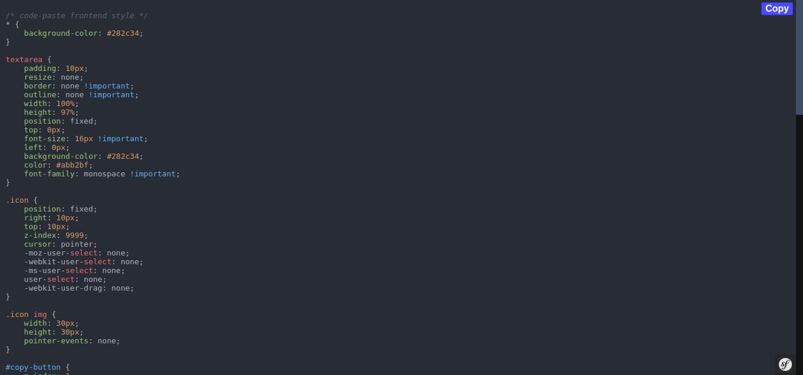

# Code paste
Free webapp service for storing and sharing text and code snippets.

## Features
- Share text and code snippets
- Encryption of paste content
- SSL only mode
- Maintenance mode
- Syntax highlighting
- Copy to clipboard

## Installation - Development
1. Clone the repository
2. Run with docker compose (scripts/docker-start-dev.sh)
3. Load testing database fixtures (scripts/load-fixtures.sh)

## Installation - Production
1. Clone the repository
2. Install dependencies (scripts/install.sh)
3. Create database & migration (scripts/migrate.sh)
4. Configure apache config [apache-site.conf](./docker/configs/apache-site.conf)

## Configuration
1. Create your own .env file with name .env.prod and change app env in main .env
2. Configure SSL_ONLY to false or true if you want to run the app on SSL with ssl traffic only
3. Configure MAINTENANCE_MODE to true or false if you want to enable maintenance mode
4. ENCRYPTION_MODE to true or false if you want to enable paste content encryption (key is APP_SECRET value in .env)
5. Configure DATABASE_DRIVER, DATABASE_HOST, DATABASE_PORT, DATABASE_NAME, DATABASE_USERNAME, DATABASE_PASSWORD

## License
This software is licensed under the [MIT license](https://github.com/lukasbecvar/code-paste/blob/main/LICENSE).
